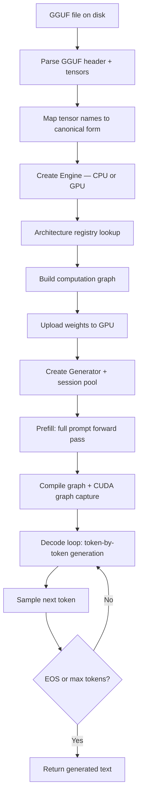
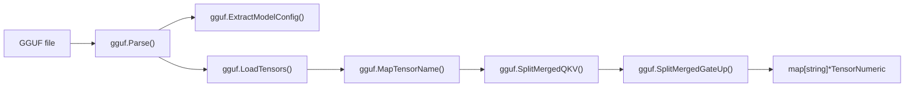
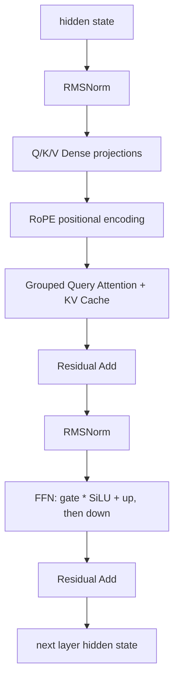
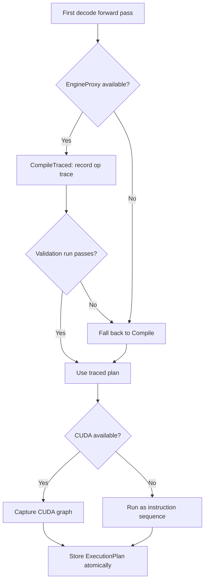
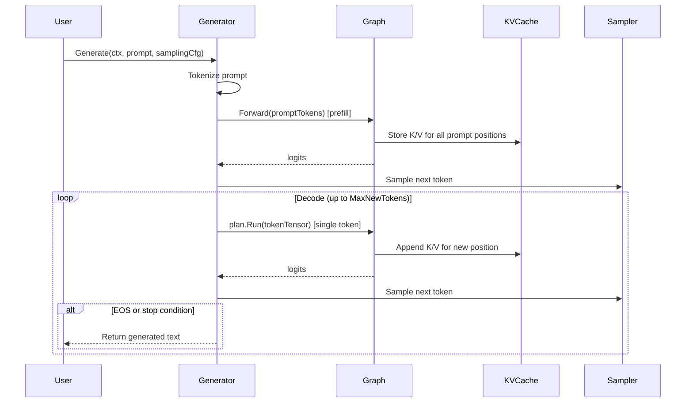
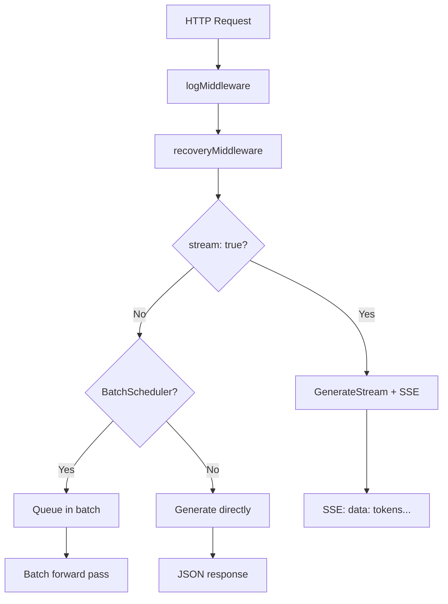

# Architecture Overview

This page walks through how Zerfoo works end-to-end, from loading a GGUF
model file to streaming tokens over an OpenAI-compatible API. It targets new
contributors who want to understand the codebase before making changes.

---

## High-Level Pipeline

When a user runs `zerfoo run gemma-3-1b-q4`, the following pipeline executes:



Each step maps to a specific function in the codebase. The rest of this
page explains each stage.

---

## Engine[T] — The Compute Abstraction

**Rule: all tensor arithmetic flows through `compute.Engine[T]`. No layer ever
operates on raw slices directly.**

`Engine[T]` is defined in `github.com/zerfoo/ztensor/compute` and provides
operations like `MatMul`, `Add`, `Reshape`, `Softmax`, `Transpose`, and more.
There are three implementations:

| Implementation | Package | Backend |
|---------------|---------|---------|
| `CPUEngine[T]` | `compute/` | Pure Go + ARM NEON / AVX2 SIMD |
| `GPUEngine[T]` | `compute/` | CUDA via purego (dlopen, no CGo) |
| `EngineProxy[T]` | `compute/` | Wraps any engine; records op traces for compilation |

Why this matters for contributors:

- **Testability.** Every layer can be tested on CPU without a GPU. Write your
  test with `CPUEngine`, and the same code runs on `GPUEngine` in CI.
- **CUDA graph capture.** The proxy records which engine operations are called
  during a forward pass. This trace is what enables CUDA graph capture later.
- **No CGo.** GPU bindings use `purego` (dlopen at runtime). A plain
  `go build ./...` compiles everywhere. CUDA is only needed at runtime.

The engine is created in `inference/engine.go:createEngine()`:

```go
func createEngine(device string) (compute.Engine[float32], error) {
    switch devType {
    case "cpu":
        return compute.NewCPUEngine[float32](numeric.Float32Ops{}), nil
    case "cuda":
        return compute.NewGPUEngine[float32](numeric.Float32Ops{}, deviceID)
    }
}
```

---

## GGUF Loading

GGUF is Zerfoo's sole model format. Loading happens in two phases.

### Phase 1: Parse and Extract

`LoadGGUF(path)` opens the file, parses the GGUF header, extracts model
config (architecture, hidden size, number of layers, etc.), and loads all
weight tensors.



Key details:

- **Tensor name mapping.** GGUF uses names like `blk.0.attn_q.weight`. Zerfoo
  maps these to canonical names like `model.layers.0.self_attn.q_proj.weight`.
  This is handled by `gguf.MapTensorName()`.
- **Merged tensor splitting.** Some architectures (e.g., Phi) store Q/K/V as a
  single merged tensor. `SplitMergedQKV()` and `SplitMergedGateUp()` split
  these into individual tensors before graph construction.
- **Quantized storage.** Tensors may use Q4, Q8, FP16, FP8, or FP32 storage.
  The storage type is preserved through loading -- quantized GEMV kernels read
  directly from `Q4Storage` without dequantization.

### Phase 2: Build Model

`LoadFile(path, opts...)` orchestrates the full pipeline:

1. Call `LoadGGUF()` to parse the file
2. Extract tokenizer from GGUF metadata
3. Create compute engine (CPU or CUDA)
4. Call `buildArchGraph()` to construct the computation graph
5. Upload weights to GPU if using `GPUEngine`
6. Create `Generator` with KV cache and session pool
7. Return a ready-to-use `*Model`

---

## Architecture Registry and Graph Builders

Zerfoo supports multiple model architectures through a registry pattern.

### The Registry

```go
type ArchBuilder func(
    tensors map[string]*tensor.TensorNumeric[float32],
    cfg     *gguf.ModelConfig,
    engine  compute.Engine[float32],
) (*graph.Graph[float32], *tensor.TensorNumeric[float32], error)
```

Each architecture registers a builder function at init time:

```go
// inference/registry_init.go
func init() {
    RegisterArchitecture("llama", buildLlamaGraph)
    RegisterArchitecture("gemma", buildGemmaGraph)
    RegisterArchitecture("gemma3", buildGemmaGraph)
    RegisterArchitecture("qwen2", buildQwenGraph)
    RegisterArchitecture("mistral", buildMistralGraph)
    RegisterArchitecture("phi", buildPhiGraph)
    RegisterArchitecture("deepseek_v3", buildDeepSeekGraph)
    RegisterArchitecture("mamba", buildMambaGraph)
    RegisterArchitecture("jamba", buildJambaGraph)
    RegisterArchitecture("whisper", buildWhisperGraph)
    // ...
}
```

The `general.architecture` field in the GGUF metadata determines which builder
is invoked. `buildArchGraph()` dispatches to the correct builder via a switch
statement (with special-case detection -- e.g., Mistral models report
`arch="llama"` but are detected by their non-zero sliding window).

### How a Builder Works

Most decoder-only architectures share the same transformer body. The shared
logic lives in `buildTransformerGraph()`, which constructs:

```text
Embed -> [RMSNorm -> GQA -> Add -> RMSNorm -> FFN(SiLU-gate) -> Add] x N -> RMSNorm -> LMHead
```

Architecture-specific builders (e.g., `buildGemmaGraph`, `buildLlamaGraph`)
call `buildTransformerGraph()` with different options:

| Option | Used By | Effect |
|--------|---------|--------|
| `embedScale` | Gemma | Multiply embeddings by sqrt(hidden_size) |
| `postNorm` | Gemma 3 | Add post-attention and post-FFN RMSNorm |
| `qkNorm` | Gemma 3 | Apply RMSNorm to Q/K after projection |
| `logitSoftcap` | Gemma 3 | cap * tanh(logit/cap) on output logits |
| `slidingWindowSize` | Mistral | Sliding window attention mask |
| `attnBias` | Qwen 2 | Add bias to Q/K/V projections |
| `partialRotaryFactor` | Phi | Apply RoPE to only a fraction of head dims |

The per-layer construction in `buildTransformerGraph()`:



### Adding a New Architecture

1. Create `inference/arch_yourmodel.go` with a `buildYourModelGraph()` function
2. If it follows the standard transformer pattern, call `buildTransformerGraph()`
   with appropriate `transformerGraphOpts`
3. Register it in `inference/registry_init.go`
4. Add a test in `inference/arch_yourmodel_test.go`

---

## Graph Compilation

After the computation graph is built, it is compiled into an `ExecutionPlan`
for efficient execution. This happens lazily on the first decode step.

### Compilation Flow



Key details:

- **Lazy compilation.** The graph is compiled after the first decode
  `Forward()` call, not during model load. This ensures the graph's internal
  memo already has the correct shapes from the decode pass (sequence length 1).
- **CompileTraced vs Compile.** When an `EngineProxy` wraps the engine,
  `CompileTraced` records the exact sequence of engine operations during a
  forward pass. This produces a more optimized plan. If tracing fails,
  compilation falls back to `Compile`.
- **Cache-free context.** Compilation runs forward passes to trace operations.
  These use a context with the KV cache stripped (`kvCacheKey{} -> nil`) to
  avoid corrupting the real cache.
- **Atomic plan storage.** Once compiled, the plan is stored via
  `atomic.Pointer` and all subsequent decode steps use `plan.Run()` instead of
  `graph.Forward()`.

---

## CUDA Graph Capture

CUDA graph capture is what gives Zerfoo near-zero kernel launch overhead during
decode. It achieves 99.5% instruction coverage on the GGUF inference path.

### How It Works

After graph compilation produces an `ExecutionPlan`, the system checks whether
CUDA graphs are available:

```go
// generate/generator.go — inside compileGraph()
if cuda.Available() && cuda.Lib().GraphAvailable() {
    ge := graph.NewCUDAGraphExecutor[T](compiled, streamPtr, 2, onCaptured, snapshotCache)
    compiled.SetMegakernelFn(func(ctx context.Context, inputs ...) {
        return ge.Run(ctx, inputs...)
    })
}
```

The `CUDAGraphExecutor`:

1. **Captures** the entire decode step as a CUDA graph -- all GPU kernel
   launches are recorded into a single replayable graph
2. **Replays** the captured graph on each subsequent decode step, replacing
   individual kernel launches with a single graph launch
3. **Protects GPU memory** -- after capture, the arena's reset floor is raised
   so `ResetPool()` doesn't reclaim buffers that the graph references
4. **Handles capture failure** -- if capture fails, KV cache state is restored
   from a snapshot and execution falls back to running instructions directly

### Why Sessions Are Pooled

CUDA graph capture records GPU pointer addresses. If a new session allocates
different GPU buffers, the captured graph's pointers become invalid. The
`Model.sessionPool` reuses sessions to keep GPU addresses stable across calls:

```go
// inference/inference.go
sessionPool chan *generate.InferenceSession[float32]
```

### Disabling CUDA Graphs

Set `ZERFOO_DISABLE_CUDA_GRAPH=1` to fall back to instruction-by-instruction
execution. Useful for debugging or when CUDA graph capture is unstable.

---

## Autoregressive Generation

The `Generator[T]` in `generate/generator.go` implements the core generation
loop.

### Prefill + Decode



Key implementation details:

- **Tensor reuse.** The decode loop pre-allocates a `[1,1]` tensor and updates
  its value in-place each step. No per-token allocation.
- **Arena reset.** Between tokens, `engine.ResetPool()` reclaims intermediate
  GPU buffers. The arena reset floor (set during CUDA graph capture) prevents
  reclaiming buffers the graph still references.
- **KV cache variants:**
  - `KVCache[T]` -- pre-allocated CPU cache for the full sequence length
  - `TensorCache` -- GPU-resident cache using engine allocations
  - `PagedKVCache[T]` -- block-based cache with a shared `BlockPool` for
    memory-efficient serving
  - `FP16KVCache` -- half-precision cache to halve GPU memory usage

### Sampling

Token selection supports:

- **Temperature scaling** -- divide logits by temperature before softmax
- **Top-K filtering** -- keep only the K highest-probability tokens
- **Top-P (nucleus) sampling** -- keep tokens until cumulative probability >= P
- **Repetition penalty** -- penalize tokens that appear in the generated history
- **Grammar-constrained decoding** -- mask logits to enforce a GBNF grammar
  (used for structured output like JSON)
- **Stop strings** -- halt generation when the output contains a target string

### Speculative Decoding

When configured with `WithSpeculativeDraft`, the generator uses a smaller
draft model to propose K tokens greedily, then verifies them against the
target model in a single batched forward pass. If the rolling acceptance
rate drops below 0.4, it falls back to standard decoding.

---

## Token Streaming

The `TokenStream` interface in `generate/stream.go` delivers tokens as they
are generated:

```go
type TokenStream interface {
    OnToken(token string, done bool) error
}
```

`GenerateStream()` follows the same prefill-then-decode pattern as `Generate()`
but calls `stream.OnToken()` after each sampled token. Returning a non-nil
error from `OnToken()` stops generation (used for client disconnects).

---

## OpenAI-Compatible API Server

The `serve/` package wraps a loaded `*inference.Model` in an HTTP server that
implements the OpenAI API specification.

### Endpoints

| Method | Path | Handler |
|--------|------|---------|
| POST | `/v1/chat/completions` | `handleChatCompletions` |
| POST | `/v1/completions` | `handleCompletions` |
| POST | `/v1/embeddings` | `handleEmbeddings` |
| GET | `/v1/models` | `handleModels` |
| DELETE | `/v1/models/{id}` | `handleModelDelete` |
| POST | `/v1/audio/transcriptions` | `handleAudioTranscriptions` |
| GET | `/metrics` | Prometheus metrics |

### Request Flow



### Server Options

| Option | Effect |
|--------|--------|
| `WithDraftModel(m)` | Enable speculative decoding |
| `WithBatchScheduler(bs)` | Group non-streaming requests into batches |
| `WithLogger(l)` | Structured request logging |
| `WithMetrics(c)` | Prometheus counters and histograms |

---

## Package Map

A quick reference for where to find things:

```text
zerfoo/
  cmd/                    CLI entry points (run, serve, pull, predict, tokenize)
  inference/
    load_gguf.go          LoadFile() — main entry point for model loading
    gguf.go               LoadGGUF() — GGUF parsing and tensor extraction
    engine.go             createEngine() — CPU/CUDA engine creation
    registry.go           Architecture registry (RegisterArchitecture, GetArchitecture)
    registry_init.go      init() — registers all built-in architectures
    arch_common.go        buildTransformerGraph() — shared decoder-only transformer
    arch_llama.go         Llama builder
    arch_gemma.go         Gemma/Gemma3 builder
    arch_deepseek.go      DeepSeek V3 builder (MLA + MoE)
    arch_mistral.go       Mistral builder (sliding window)
    arch_qwen.go          Qwen 2 builder (attention bias)
    arch_phi.go           Phi builder (partial rotary)
    inference.go          Model struct — ties generator, tokenizer, engine together
  generate/
    generator.go          Generator[T] — prefill, decode loop, compilation
    stream.go             TokenStream interface, GenerateStream()
    sampling.go           Temperature, top-K, top-P, repetition penalty
    kvcache.go            CPU KV cache
    gpu_kv_cache.go       GPU-resident KV cache
    paged_kv.go           Paged KV cache with BlockPool
    speculative.go        Speculative decoding with draft model
    session.go            InferenceSession — reusable decode state
  serve/
    server.go             OpenAI-compatible HTTP server
    batch.go              BatchScheduler for request grouping
    metrics.go            Prometheus metrics integration
    vision.go             Vision/multimodal endpoint support
    tool_calls.go         Tool calling support
  layers/                 56+ neural network operations (18 sub-packages)
    attention/            GQA, MHA, MLA, sliding window
    normalization/        RMSNorm, LayerNorm, GroupNorm
    activations/          SiLU, GELU, ReLU, Swish
    embeddings/           RoPE, token embeddings
    core/                 Linear, Dense, FFN, MatMul, Conv2d, MoE
  model/
    gguf/                 GGUF parser, tensor name mapping, config extraction
  training/               Trainer[T], AdamW, SGD, loss functions
  distributed/            gRPC + NCCL distributed training

# External packages (separate repos):
# github.com/zerfoo/ztensor — tensor, compute engine, graph, GPU kernels
# github.com/zerfoo/ztoken  — BPE tokenizer
```

---

## Further Reading

- [Getting Started]() -- build and run instructions
- [GPU Setup]() -- CUDA/ROCm configuration
- [API Reference]() -- OpenAI-compatible API documentation
